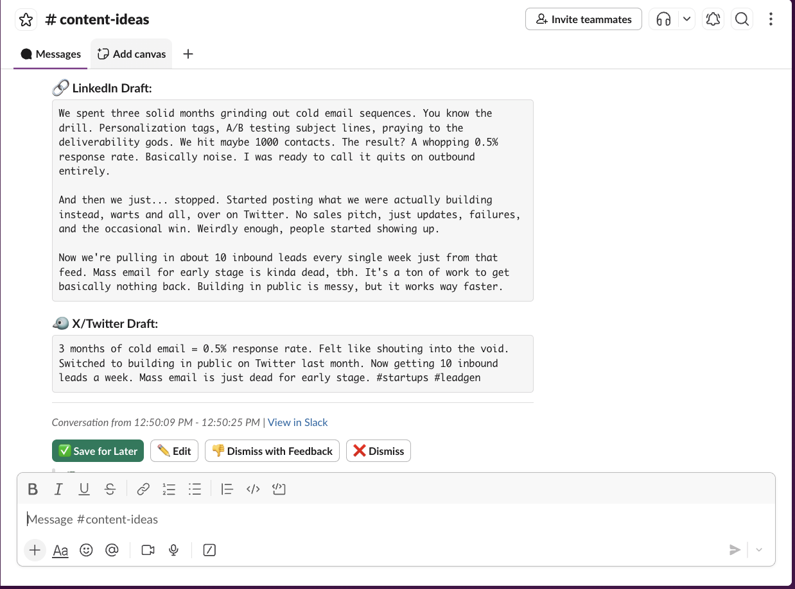

# Slack Content Bot

A smart Slack bot that monitors your team's conversations and automatically suggests high-quality LinkedIn and X/Twitter posts based on content-worthy moments. Powered by Google Gemini.



## Features

### 🧠 Intelligent Detection
*   **Context-Aware**: Analyzes full conversations, not just single messages.
*   **Thread Support**: Treats threads as distinct conversations, ensuring side-discussions aren't missed.
*   **Quality Thresholds**: Only alerts you for "Medium" or "High" quality content (configurable).

### ✍️ Draft Generation
*   **Platform Native**: Generates separate drafts optimized for LinkedIn (professional, story-driven) and X/Twitter (punchy, thread-ready).
*   **Source Linking**: Includes direct links back to the original Slack conversation for context.

### 🔄 Active Learning Feedback Loop
*   **Dismiss with Feedback**: Don't just delete bad suggestions—tell the bot *why*.
*   **Adaptive Prompts**: The bot learns from your feedback (e.g., "Too robotic", "Don't use emojis") and avoids those patterns in future generations.

### 🛠️ Configurable
*   **Quality Filter**: Set `MIN_STRENGTH_TO_POST` to `low`, `medium`, or `high`.
*   **Creativity**: Tune the AI `TEMPERATURE` for more safe or more creative outputs.

---

## Setup Guide

### 1. Create Slack App
Go to [api.slack.com/apps](https://api.slack.com/apps) and create a new **App from Manifest**:

```yaml
display_information:
  name: Content Bot
  description: Suggests LinkedIn and X posts from your conversations
settings:
  socket_mode_enabled: true
  event_subscriptions:
    bot_events:
      - message.channels
features:
  bot_user:
    display_name: Content Bot
    always_online: true
oauth_config:
  scopes:
    bot:
      - channels:history
      - channels:read
      - chat:write
      - users:read
```

### 2. Get Credentials
1.  **Bot Token** (`xoxb-...`): OAuth & Permissions page.
2.  **App Token** (`xapp-...`): Basic Information page → App-Level Tokens.
3.  **Signing Secret**: Basic Information page.

### 3. Get Channel IDs
Right-click a channel → View channel details → Copy Channel ID (e.g., `C0123456789`).
*   **Watch Channels**: The channels where your team talks (e.g., `#random`, `#product`).
*   **Ideas Channel**: The channel where the bot posts suggestions (e.g., `#content-ideas`).

### 4. Install & Configure
Clone the repo and set up your environment:

```bash
npm install
cp .env.example .env
```

Edit `.env` with your keys:
```bash
# Slack Params
SLACK_BOT_TOKEN=xoxb-...
SLACK_APP_TOKEN=xapp-...
SLACK_SIGNING_SECRET=...
SLACK_WORKSPACE_DOMAIN=your-subdomain # e.g., 'acme-corp' (for message links)

# Channels
WATCH_CHANNEL_IDS=C01...,C02...
CONTENT_IDEAS_CHANNEL_ID=C09...

# AI Configuration (Choose one provider)
# Option 1: Google (Default)
LLM_PROVIDER=google
GOOGLE_API_KEY=AIza...

# Option 2: OpenAI
# LLM_PROVIDER=openai
# OPENAI_API_KEY=sk-...
# LLM_MODEL=gpt-4-turbo-preview

# Option 3: Anthropic
# LLM_PROVIDER=anthropic
# ANTHROPIC_API_KEY=sk-ant-...
# LLM_MODEL=claude-3-5-sonnet-20241022

# Common Settings
TEMPERATURE=0.7         # 0.0 = Focused, 1.0 = Creative
MIN_STRENGTH_TO_POST=medium # low | medium | high
```

### 5. Run it
```bash
# Development
npm run dev

# Production
npm run build
npm start
```

---

## Usage

### The Workflow
1.  **Chat Normally**: Have conversations in your watched channels.
2.  **Wait for Detection**: 
    *   The bot waits for a "pause" in conversation (default: 5 mins) or for a thread to go quiet.
    *   If a chunk of conversation is strong enough, it posts to `#content-ideas`.
3.  **Review Suggestion**:
    *   **Edit**: Click ✏️ to tweak the draft in a modal before copying.
    *   **Dismiss**: Click ❌ to just delete it.
    *   **Dismiss with Feedback**: Click 👎 to tell the bot *why* (e.g., "Hallucinated", "Boring"). It will learn from this!

### How Detection Works
The bot looks for:
*   **Contrarian Takes**: "Everyone thinks X, but actually Y..."
*   **Specific Metrics**: "We spent $12k and got 0 leads..."
*   **Lessons Learned**: "Here's how we fixed our churn..."
*   It ignores: Short messages, scheduling talk, lunch plans.

## Customization
*   **Writing Style**: Edit `prompts/writing-rules.txt` to change the tone of drafts.
*   **Detection Criteria**: Edit `prompts/detect-content.txt` to change what the bot looks for.

## 🚀 Deployment (Railway)

The easiest way to deploy is using [Railway](https://railway.app).

1.  **Fork/Clone** this repo to your GitHub.
2.  **New Project** on Railway → "Deploy from GitHub repo".
3.  **Select** your `slack-content-bot` repository.
3.  **Variables**: Add the following Environment Variables in Railway:
    *   `SLACK_BOT_TOKEN`
    *   `SLACK_APP_TOKEN`
    *   `SLACK_SIGNING_SECRET`
    *   `SLACK_WORKSPACE_DOMAIN`
    *   `WATCH_CHANNEL_IDS`
    *   `CONTENT_IDEAS_CHANNEL_ID`
    *   `LLM_PROVIDER` (e.g., `google`)
    *   `GOOGLE_API_KEY` (or `OPENAI_API_KEY` / `ANTHROPIC_API_KEY`)
4.  **Deploy**: Railway will automatically detect `npm run build` and `npm start`.

*Note: Since this bot uses Socket Mode, you do NOT need a public domain or webhook configuration! It just works.*